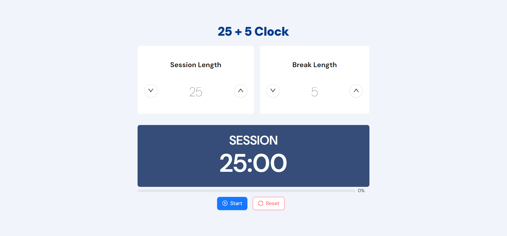

# 25 + 5 Clock

## Overview

The **25 + 5 Clock** is a web-based productivity tool inspired by the Pomodoro Technique, designed to help users manage their work and break sessions effectively.

## Technologies Used

- [React](https://react.dev/)
- [TypeScript](https://www.typescriptlang.org/)
- [Redux Toolkit](https://redux-toolkit.js.org/)
- [Ant Design (React UI)](https://ant.design/)

## Features

- **Increment and Decrement Buttons**: Easily adjust your break and session lengths with intuitive increment and decrement buttons.

- **Default Values**: The default break length is set to 5 minutes, while the default session length is 25 minutes.

- **Timer Label**: A dynamic timer label indicates whether a session or break is in progress.

- **Time Left Display**: Always know how much time is remaining in your current session or break, displayed in the format "mm:ss".

- **Start/Stop Button**: Initiate and pause your timer with a simple click on the "Start/Stop" button.

- **Reset Button**: Reset the timer and session lengths by clicking the "Reset" button.

- **Seamless Transitions**: The clock smoothly transitions between work and break sessions.

- **Audio Alerts**: You'll be alerted with a sound when a session or break ends, making it easier to stay on track.

## Getting Started

I deployed this project on Netlify: [Project Link](https://netlify.user.x)

To use the **25 + 5 Clock**, follow these steps:

1. Clone the repository to your local machine.
2. Install the necessary dependencies by running `npm install` in the project directory.
3. Start the application with `npm start`. This will open the clock in your default web browser.
4. Customize your session and break lengths as needed.

## License

This project is licensed under the MIT License, allowing you to use, modify, and distribute the code freely, provided you include the original license in your distribution.
